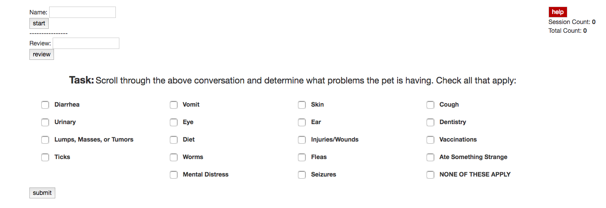

# Collecting Labeled Data

The goal of the following set up was a quick and free deployment to collect labeled data.  The  high level data flow consisted of a static webpage hosted on github pages which POSTed information to an AWS Lambda function.  The lambda function handled that POST request, querying an AWS DynamoDB database when appropriate and sending the appropriate data back to the website.  All code can be found at [https://github.com/Micpic3/vet](https://github.com/Micpic3/vet).

**Github Pages:** [https://micpic3.github.io/vet/](https://micpic3.github.io/vet/) 

When first entering the site, the page looks as follows:

In the top right corner, there is a ‘help’ button linking to a pdf to explain the task and the website.  There is also a ‘session count’ and ‘total count’ that will list the number of conversations labeled this session, and the number of conversations labeled by that user in total.  

On the top left side of the page, there is a field called ‘Name’ used to enter a username in order to start labeling data.  There is another field called ‘Review’ used to enter a conversation ID in order to review a previously labeled conversation.   When submitting a new name, a new user is registered.  When submitting an already used name, the total count for that user is received.  A conversation will also be requested and loaded when clicking start or review with a valid input.  

After a conversation is loaded, the user is able to read the conversation, fill out the appropriate labels, and submit the labels.  A new conversation will be loaded after the submission.

The website was required to be static, so only HTML and Javascript were used. 

**AWS Lambda:**

The lambda function handles all requests from the website and interfaces with AWS DynamoDB to store and retrieve the appropriate data.  This function handles the logic of moving data between databases, updating the databases with new information from the user, and delivering the appropriate data to the user.  All of the logic is handled in a single lambda function at a single endpoint. It could be broken up to be more clean with multiple endpoints, but was chosen to stay in a single function to allow for quicker development.

**AWS DynamoDB**

This database consists of four separate tables.  One table is used to keep track of the user and their count, and the other three are for keeping track of what state of being labeled it is in.  There are three tables for keeping track of what has been labeled in order to reduce the number of reads from the AWS Lambda function.  These multiple tables allow for a single query from the AWS Lambda function, rather than a worst case scenario of reading all conversations in the database when trying to find an unlabeled conversation.

**vetconversations:** 

The initial table where all conversations are first loaded to.  

<table>
  <tr>
    <td>convo_id</td>
    <td>convo</td>
    <td>labeled</td>
    <td>labeler</td>
    <td>labels</td>
  </tr>
  <tr>
    <td>ID of conversation</td>
    <td>Conversation in HTML form</td>
    <td>Whether this conversation has been labeled.  Should always be ‘false’.</td>
    <td>The name of the labeler.  Should always be ‘None’</td>
    <td>Array of labels.  Should always be [{"S":”None”}]</td>
  </tr>
</table>

**vetconversationsinuse:**

The table representing limbo for conversations.  Conversations go here when the conversation has been delivered to the user, but not filled out and submitted. The conversations go from ‘vetconversations’ to ‘vetconversationsinuse’. This also means that a conversation will stay in here if the user exits out of their browser.  There is a separate lambda function to move these conversations back to the ‘vetconversations’ table when they build up.  It could be set up so there need be no manual involvement, but for the sake of time was set up this way.  When the user fills out the labels and clicks ‘submit’, the conversation is moved from ‘vetconversationsinuse’ to  ‘vetconversationslabeled’.  This table is important to prevent two users from checking out the same conversation.

<table>
  <tr>
    <td>convo_id</td>
    <td>convo</td>
    <td>labeled</td>
    <td>labeler</td>
    <td>labels</td>
  </tr>
  <tr>
    <td>ID of conversation</td>
    <td>Conversation in HTML form</td>
    <td>Whether this conversation has been labeled.  Should always be ‘false’.</td>
    <td>The name of the labeler who checked it out.</td>
    <td>Array of labels.  Should always be [{"S":”None”}]</td>
  </tr>
</table>

**vetconversationslabeled:**

Contains all of the labeled conversations.  Moved from ‘vetconversationsinuse’ to here every time the user submits.

<table>
  <tr>
    <td>convo_id</td>
    <td>convo</td>
    <td>labeled</td>
    <td>labeler</td>
    <td>labels</td>
  </tr>
  <tr>
    <td>ID of conversation</td>
    <td>Conversation in HTML form</td>
    <td>Whether this conversation has been labeled.  Should always be ‘true’.</td>
    <td>The name of the labeler.</td>
    <td>Array of labels.  In the form [{"S":”Diet”},{“S”:”Fleas”}]</td>
  </tr>
</table>

**vetusercount:**

The users mapped to their total number of labeled conversations. Updated every time a conversation is submitted.  A new username is created when a new username is entered on the website. 

<table>
  <tr>
    <td>username</td>
    <td>count</td>
  </tr>
  <tr>
    <td>The name of the user.  Lowercase and whitespace removed</td>
    <td>The number of conversations labeled by this user.</td>
  </tr>
</table>

